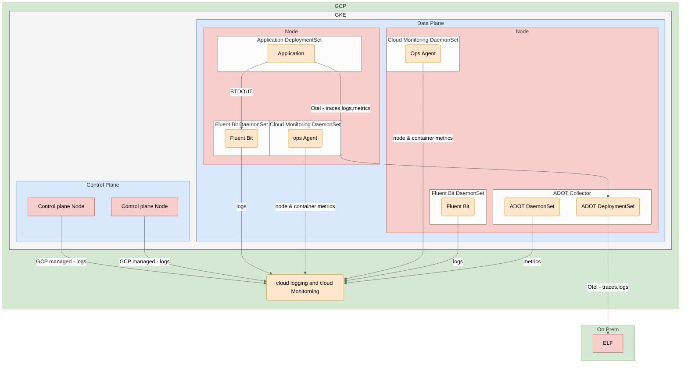

%%{
  init: {
    'theme': 'neutral',
    'themeVariables': {
      'backgroundColor': '#F5F5F5',
      'primaryarrowcolor': '#000000'
    }
  }
}%%
flowchart TD
    subgraph GCP[GCP]
        subgraph GKE
            subgraph control_plane[Control Plane]
                cp_node_1[Control Plane Node]
                cp_node_2[Control Plane Node]
            end
            subgraph data_plane[Data Plane]
                subgraph Node_1[Node]
                    subgraph otelcol_pod_1[OTel Collector]
                        otel_1(OTel Deployment)
                        otel_2(OTel DaemonSet)
                    end
                    subgraph fluentbit_pod_1[Fluent Bit DaemonSet]
                        fluentbit_1(Fluent Bit)
                    end
                    subgraph ops_agent_pod_1[Ops Agent DaemonSet]
                        ops_agent_1(Ops Agent)
                    end
                end

                subgraph Node_2[Node]
                    subgraph application_pod_2[Application Deployment]
                        application_2[Application]
                    end
                    subgraph fluentbit_pod_2[Fluent Bit DaemonSet]
                        fluentbit_2(Fluent Bit)
                    end
                    subgraph ops_agent_pod_2[Ops Agent DaemonSet]
                        ops_agent_2(Ops Agent)
                    end
                    application_2 --->|STDOUT| fluentbit_2
                end

                application_2 ---->|OTel - traces, logs, metrics| otel_1
            end
        end

        otel_2 -->|metrics| cloudlogging
        fluentbit_1 -->|logs| cloudlogging
        ops_agent_1 -->|node & container metrics| cloudlogging
        ops_agent_2 -->|node & container metrics| cloudlogging
        fluentbit_2 -->|logs| cloudlogging
        cp_node_1 -->|GCP managed - logs| cloudlogging
        cp_node_2 -->|GCP managed - logs| cloudlogging
        cloudlogging(Cloud Logging & Monitoring)
    end

    subgraph External[ELF Endpoint]
        otel_1 --->|Traces| ELF
    end

%% Styling
    classDef node fill: #F8CECC, stroke: #B85450, stroke-width: 1px;
    classDef application fill: #FFE6CC, stroke: #D79B00, stroke-width: 1px;
    classDef plane fill: #DAE8FC, stroke: #6C8EBF, stroke-width: 1px;
    classDef CSP fill: #D5E8D4, stroke: #82B366, stroke-width: 1px;
    classDef GKE fill: #F5F5F5, stroke: #666666, stroke-width: 1px;
    control_plane:::plane
    data_plane:::plane
    Node_1:::node
    Node_2:::node
    otel_1:::application
    otel_2:::application
    application_2:::application
    fluentbit_1:::application
    fluentbit_2:::application
    cloudlogging:::application
    ops_agent_1:::application
    ops_agent_2:::application
    GCP:::CSP
    External:::CSP
    GKE:::GKE
