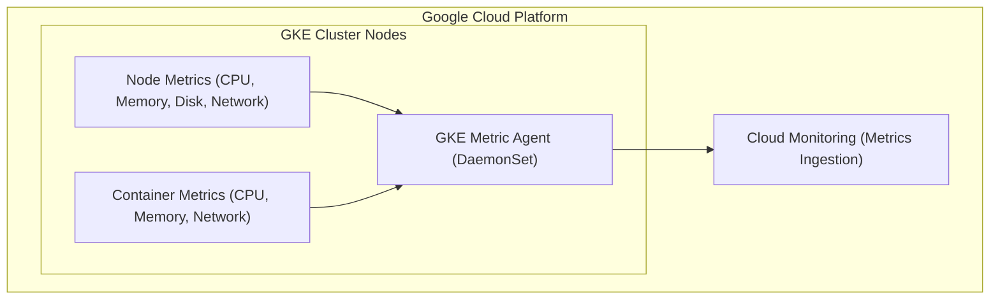

```mermaid
flowchart TD
    subgraph GCP [Google Cloud Platform]
        subgraph GKE [GKE Cluster Nodes]
            nodeMetrics["Node Metrics (CPU, Memory, Disk, Network)"] --> GKE_Metric_Agent["GKE Metric Agent (DaemonSet)"]
            containerMetrics["Container Metrics (CPU, Memory, Network)"] --> GKE_Metric_Agent
        end
        GKE_Metric_Agent --> monitoring["Cloud Monitoring (Metrics Ingestion)"]
    end
```
