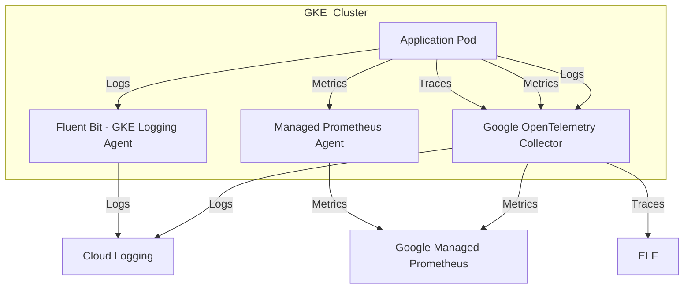
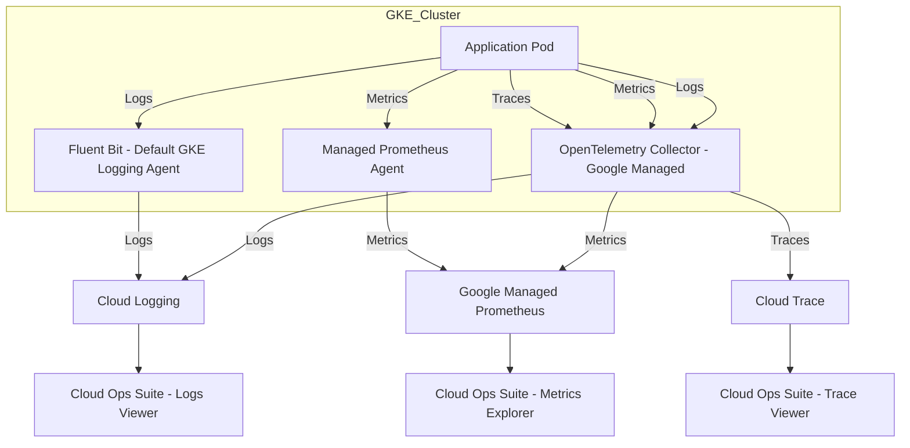
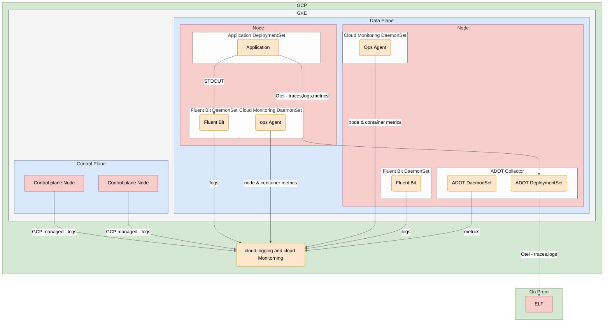
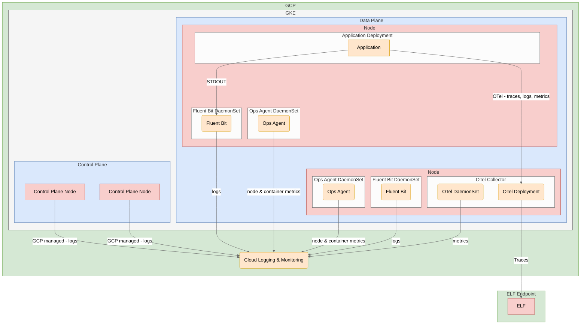
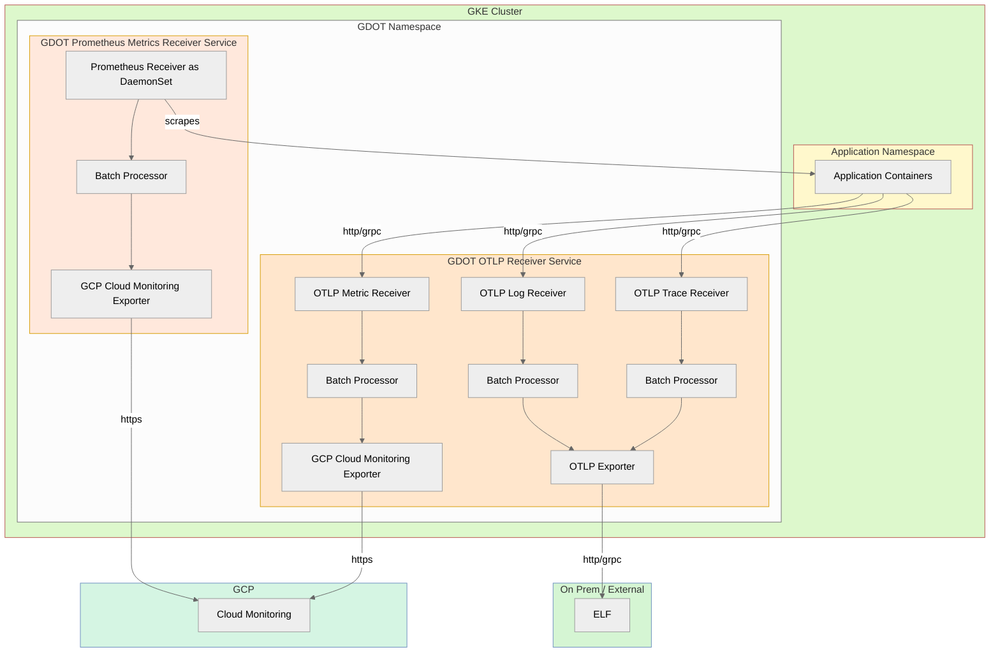

```mermaid
   graph TD
    subgraph GKE_Cluster
        App[Application Pod]
        FL[Fluent Bit - GKE Logging Agent]
        PromAgent[Managed Prometheus Agent]
        GOTC[Google OpenTelemetry Collector]
    end

    %% App telemetry sources
    App -->|Logs| FL
    App -->|Metrics| PromAgent
    App -->|Traces| GOTC
    App -->|Metrics| GOTC
    App -->|Logs| GOTC

    %% Fluent Bit path
    FL -->|Logs| CloudLogging[Cloud Logging]

    %% Prometheus path
    PromAgent -->|Metrics| GMP[Google Managed Prometheus]

    %% GOTC telemetry routing
    GOTC -->|Traces| ELF
    GOTC -->|Logs| CloudLogging
    GOTC -->|Metrics| GMP

```

```mermaid
   graph TD
    subgraph GKE_Cluster
        App[Application Pod]
        OTEL[OpenTelemetry Collector - Google Managed]
        PromAgent[Managed Prometheus Agent]
        FL[Fluent Bit - Default GKE Logging Agent]
    end

    %% App telemetry
    App -->|Logs| FL
    App -->|Metrics| PromAgent
    App -->|Traces| OTEL
    App -->|Metrics| OTEL
    App -->|Logs| OTEL

    %% Data flow to Google Cloud
    FL -->|Logs| CloudLogging[Cloud Logging]
    PromAgent -->|Metrics| GMP[Google Managed Prometheus]
    OTEL -->|Traces| CloudTrace[Cloud Trace]
    OTEL -->|Logs| CloudLogging
    OTEL -->|Metrics| GMP

    %% Visualization layer
    CloudLogging --> OpsSuite1[Cloud Ops Suite - Logs Viewer]
    CloudTrace --> OpsSuite2[Cloud Ops Suite - Trace Viewer]
    GMP --> OpsSuite3[Cloud Ops Suite - Metrics Explorer]

```

==============================

```mermaid
%%{
  init: {
    'theme': 'neutral',
    'themeVariables': {
      'backgroundColor': '#F5F5F5',
      'primaryarrowcolor': '#000000'
    }
  }
}%%
flowchart TD
    subgraph GCP[GCP]
        subgraph GKE
            subgraph control_plane[Control Plane]
                cp_node_1[Control plane Node]
                cp_node_2[Control plane Node]
            end
            subgraph data_plane[Data Plane]
                subgraph Node_1[Node]
                    subgraph adot_pod_1[ADOT Collector]
                        adot_1(ADOT DeploymentSet)
                        adot_2(ADOT DaemonSet)
                    end
                    subgraph fluentbit_pod_1[Fluent Bit DaemonSet]
                        fluentbit_1(Fluent Bit)
                    end
                    subgraph cw_agent_pod_1[Cloud Monitoring DaemonSet]
                        cw_agent_1(Ops Agent)
                    end

                end

                subgraph Node_2[Node]
                    subgraph application_pod_2[Application DeploymentSet]
                        application_2[Application]
                    end
                    subgraph fluentbit_pod_2[Fluent Bit DaemonSet]
                        fluentbit_2(Fluent Bit)
                    end
                    subgraph cw_agent_pod_2[Cloud Monitoring DaemonSet]
                        cw_agent_2(ops Agent)
                    end
                    application_2 --->|STDOUT| fluentbit_2

                end
                application_2 ---->|Otel - traces,logs,metrics | adot_1
            end

        end
        adot_2 -->| metrics| cloudlogging
        fluentbit_1 -->|logs| cloudlogging
        cw_agent_1 -- node & container metrics -----> cloudlogging
        cw_agent_2 -->|node & container metrics| cloudlogging
        fluentbit_2 -->|logs| cloudlogging
        cp_node_1 -->|GCP managed - logs| cloudlogging
        cp_node_2 -->|GCP managed - logs| cloudlogging
        cloudlogging(cloud logging and cloud Monitorning )
    end

    subgraph onPrem[On Prem]
        adot_1 --->|Otel - traces,logs| ELF

    end
%% styling
    classDef node fill: #F8CECC, stroke: #B85450, stroke-width: 1px;
    classDef application fill: #FFE6CC, stroke: #D79B00, stroke-width: 1px;
    classDef plane fill: #DAE8FC, stroke: #6C8EBF, stroke-width: 1px;
    classDef CSP fill: #D5E8D4, stroke: #82B366, stroke-width: 1px;
    classDef GKE fill: #F5F5F5, stroke: #666666, stroke-width: 1px;
    control_plane:::plane
    data_plane:::plane
    Node_1:::node
    Node_2:::node
    adot_1:::application
    adot_2:::application
    application_2:::application
    fluentbit_1:::application
    fluentbit_2:::application
    cloudlogging:::application
    cw_agent_1:::application
    cw_agent_2:::application
    GCP:::CSP
    onPrem:::CSP
    GKE:::GKE
```

```mermaid
%%{
  init: {
    'theme': 'neutral',
    'themeVariables': {
      'backgroundColor': '#F5F5F5',
      'primaryarrowcolor': '#000000'
    }
  }
}%%
flowchart TD
    subgraph GCP[GCP]
        subgraph GKE
            subgraph control_plane[Control Plane]
                cp_node_1[Control Plane Node]
                cp_node_2[Control Plane Node]
            end
            subgraph data_plane[Data Plane]
                subgraph Node_1[Node]
                    subgraph otelcol_pod_1[OTel Collector]
                        otel_1(OTel Deployment)
                        otel_2(OTel DaemonSet)
                    end
                    subgraph fluentbit_pod_1[Fluent Bit DaemonSet]
                        fluentbit_1(Fluent Bit)
                    end
                    subgraph ops_agent_pod_1[Ops Agent DaemonSet]
                        ops_agent_1(Ops Agent)
                    end
                end

                subgraph Node_2[Node]
                    subgraph application_pod_2[Application Deployment]
                        application_2[Application]
                    end
                    subgraph fluentbit_pod_2[Fluent Bit DaemonSet]
                        fluentbit_2(Fluent Bit)
                    end
                    subgraph ops_agent_pod_2[Ops Agent DaemonSet]
                        ops_agent_2(Ops Agent)
                    end
                    application_2 --->|STDOUT| fluentbit_2
                end

                application_2 ---->|OTel - traces, logs, metrics| otel_1
            end
        end

        otel_2 -->|metrics| cloudlogging
        fluentbit_1 -->|logs| cloudlogging
        ops_agent_1 -->|node & container metrics| cloudlogging
        ops_agent_2 -->|node & container metrics| cloudlogging
        fluentbit_2 -->|logs| cloudlogging
        cp_node_1 -->|GCP managed - logs| cloudlogging
        cp_node_2 -->|GCP managed - logs| cloudlogging
        cloudlogging(Cloud Logging & Monitoring)
    end

    subgraph External[ELF Endpoint]
        otel_1 --->|Traces| ELF
    end

%% Styling
    classDef node fill: #F8CECC, stroke: #B85450, stroke-width: 1px;
    classDef application fill: #FFE6CC, stroke: #D79B00, stroke-width: 1px;
    classDef plane fill: #DAE8FC, stroke: #6C8EBF, stroke-width: 1px;
    classDef CSP fill: #D5E8D4, stroke: #82B366, stroke-width: 1px;
    classDef GKE fill: #F5F5F5, stroke: #666666, stroke-width: 1px;
    control_plane:::plane
    data_plane:::plane
    Node_1:::node
    Node_2:::node
    otel_1:::application
    otel_2:::application
    application_2:::application
    fluentbit_1:::application
    fluentbit_2:::application
    cloudlogging:::application
    ops_agent_1:::application
    ops_agent_2:::application
    GCP:::CSP
    External:::CSP
    GKE:::GKE
```

```mermaid
%%{
  init: {
    'theme': 'neutral',
    'themeVariables': {
      'backgroundColor': '#F5F5F5',
      'primaryarrowcolor': '#000000'
    }
  }
}%%

graph TD
    subgraph gkecluster[GKE Cluster]
    
    subgraph userns[Application Namespace]
        direction LR
        A[Application Containers]
    end

    subgraph gdotns[GDOT Namespace]
      direction LR

      subgraph gdotsvc[GDOT OTLP Receiver Service]
        M[OTLP Metric Receiver]
        L[OTLP Log Receiver]
        T[OTLP Trace Receiver]

        MP[Batch Processor]
        LP[Batch Processor]
        TP[Batch Processor]
        
        exp1[GCP Cloud Monitoring Exporter]
        exp3[OTLP Exporter]
      end

      subgraph promsvc[GDOT Prometheus Metrics Receiver Service]
        S[Prometheus Receiver as DaemonSet] --> |scrapes| A
        S --> SP[Batch Processor]
        SP --> exp11[GCP Cloud Monitoring Exporter]       
      end

        A -->|http/grpc| M
        A -->|http/grpc| L
        A -->|http/grpc| T
        M --> MP
        L --> LP
        T --> TP
        MP --> exp1
        LP --> exp3
        TP --> exp3
    end  
end

    subgraph elf_forwarding_storage[On Prem / External]
        direction LR
        exp3 -->|http/grpc| TB[ELF]
    end

    subgraph metric_forwarding_storage[GCP]
        direction LR
        exp11 -->|https| MB[Cloud Monitoring]
        exp1 -->|https| MB[Cloud Monitoring]       
    end

%% styling
    classDef clusterstyle fill: #DDF8CC, stroke: #B85450, stroke-width: 1px;
    classDef lgenstyle fill: #FFF8CC, stroke: #B85450, stroke-width: 1px;
    classDef gdotstyle fill: #FFE6CC, stroke: #D79B00, stroke-width: 1px;
    classDef promstyle fill: #FFE8DC, stroke: #D79B00, stroke-width: 1px;
    classDef gcpstyle fill: #D5F5E3, stroke: #6C8EBF, stroke-width: 1px;
    classDef elfstyle fill: #D5F5D3, stroke: #6C8EBF, stroke-width: 1px;
    gkecluster:::clusterstyle
    userns:::lgenstyle
    gdotsvc:::gdotstyle
    promsvc:::promstyle
    elf_forwarding_storage:::elfstyle
    metric_forwarding_storage:::gcpstyle

```
